# UVA Pickleball Club Management Platform

A full-stack web platform built for the **UVA Pickleball Club** to centralize club operations, events, practices, tournaments, member registration, announcements, and community information.

The project is designed around the needs of a real university sports organization, providing members with one place to discover club activities while giving club leadership a foundation for managing operations digitally.

<p align="center">
  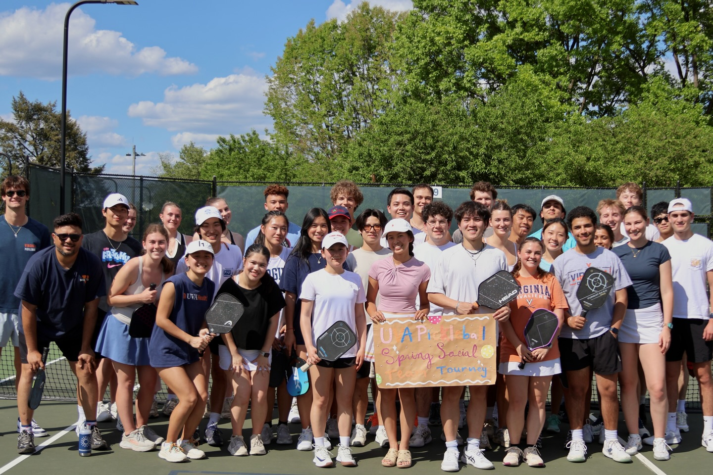
</p>

<p align="center">
  <strong>Play. Connect. Compete.</strong>
</p>

---

## About the Project

UVA Pickleball serves a growing community of recreational, social, and competitive players at the University of Virginia.

Managing schedules, tryouts, events, announcements, merchandise, registrations, and member communication across separate platforms can quickly become difficult as a club grows.

This project is being developed as a centralized platform where students can:

* Discover the UVA Pickleball Club
* View upcoming events and announcements
* Check weekly practice and open-play schedules
* Learn about tryouts and membership
* Explore tournament and social teams
* View club merchandise
* Access club photos and community highlights
* Register and manage club participation as the platform expands

The long-term goal is to reduce repetitive administrative work for club officers while creating a better experience for members.

---

## Project Preview

### Club Experience

<p align="center">
  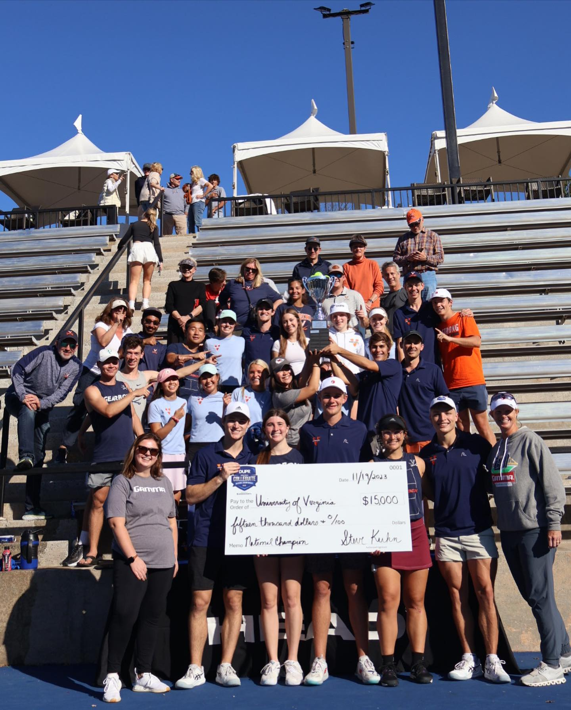
</p>

The public-facing website introduces students to the club, explains how membership works, and provides centralized access to schedules, events, announcements, teams, and club resources.

### Competition & Community

<p align="center">
  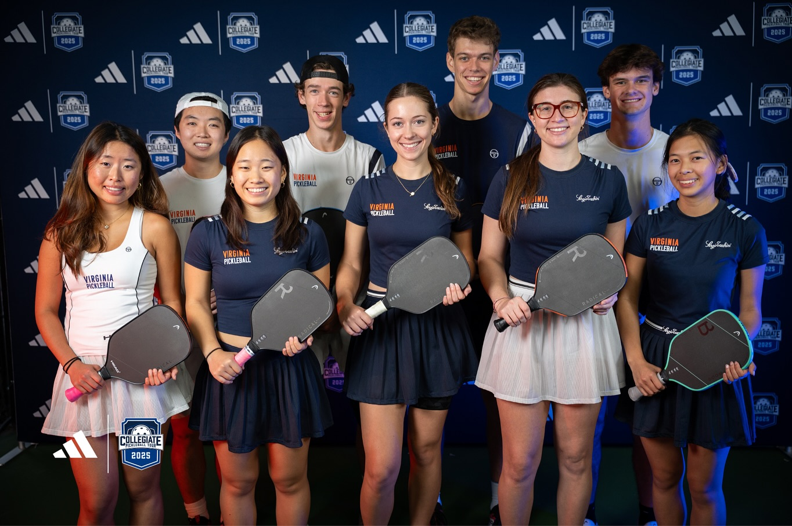
  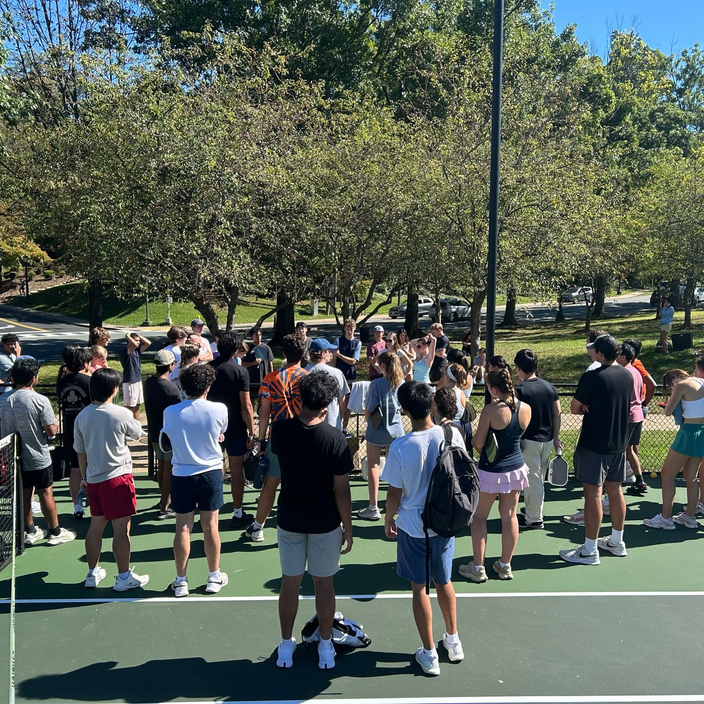
</p>

The platform is designed for multiple levels of club participation, from social open play to competitive tournament teams.

### Events & Club Activities

<p align="center">
  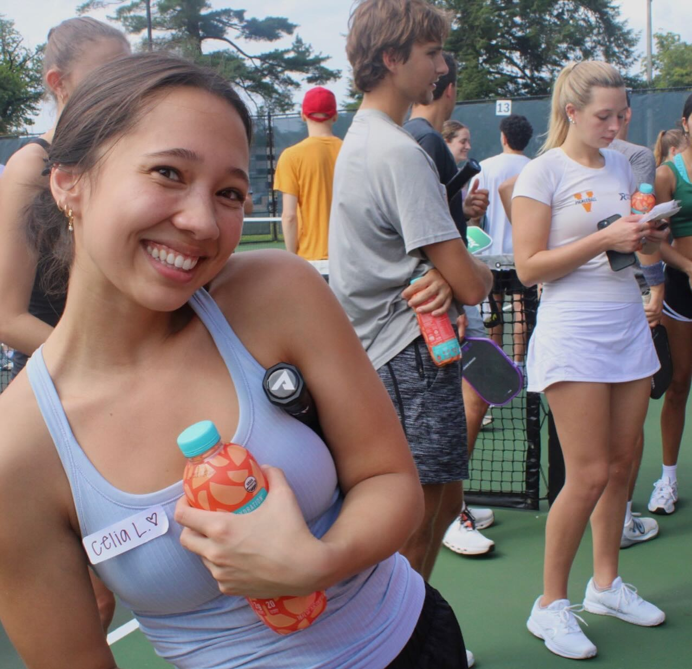
  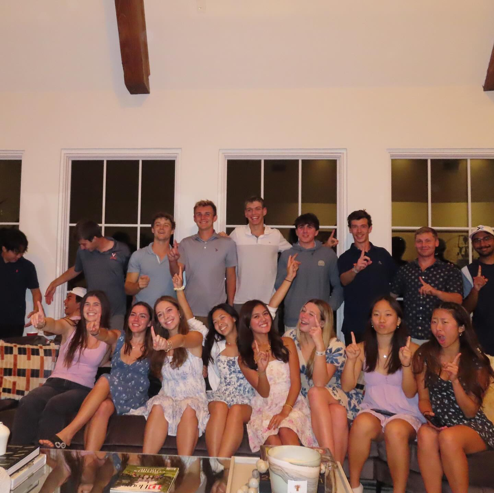
</p>

Members can discover club events, practices, tournaments, social activities, and other opportunities through a unified interface.

---

## Features

### Current

* Responsive club website for desktop and mobile
* Club information and membership process
* Tryout information and selection flow
* Event listings
* Weekly practice and open-play schedule
* Tournament team roster
* Announcements and club updates
* Merchandise catalog
* Sponsor showcase
* Photo gallery
* Contact and social links

### In Development

* UVA student authentication
* Member profiles
* Online event registration
* Role-based access for members and club administrators
* Database-backed event and registration management
* Payment workflow for club fees and merchandise
* Administrative management tools
* Cloud-based media storage

---

## Tech Stack

| Area            | Technology            |
| --------------- | --------------------- |
| Framework       | Next.js               |
| Language        | TypeScript            |
| UI              | React                 |
| Styling         | Tailwind CSS          |
| Components      | shadcn/ui             |
| Database        | PostgreSQL / Supabase |
| Authentication  | Supabase Auth         |
| Media Storage   | Amazon S3             |
| Deployment      | Vercel                |
| Version Control | Git & GitHub          |

> Some backend and administrative features are currently under development. The repository is being actively expanded from a public-facing club website into a complete club management platform.

---

## Application Structure

```text
src/
├── app/
│   ├── about/
│   ├── announcements/
│   │   └── tryoutdetails/
│   ├── contact/
│   ├── events/
│   ├── login/
│   ├── merch/
│   ├── schedule/
│   └── team/
│
├── components/
│   ├── events/
│   ├── home/
│   ├── layout/
│   └── ui/
│
├── data/
│   ├── events.ts
│   └── schedule.ts
│
└── lib/
```

The project uses the **Next.js App Router** with reusable components separated by feature and shared layout/UI responsibilities.

---

## Architecture

```text
                    ┌─────────────────────┐
                    │      Next.js        │
                    │   React Frontend    │
                    └──────────┬──────────┘
                               │
                ┌──────────────┴──────────────┐
                │                             │
        ┌───────▼────────┐            ┌───────▼────────┐
        │    Supabase    │            │   Amazon S3    │
        │                │            │                │
        │ Authentication│            │ Gallery / Media│
        │ PostgreSQL     │            │    Storage     │
        └───────┬────────┘            └────────────────┘
                │
        ┌───────▼────────┐
        │ Club Operations│
        │                │
        │ Members        │
        │ Events         │
        │ Registrations  │
        │ Roles          │
        └────────────────┘
```

The architecture separates structured application data from media storage. PostgreSQL is intended to manage users, events, registrations, and club data, while Amazon S3 can support scalable storage for club and event photography.

---

## Engineering Goals

This project goes beyond building a static club website. It is intended to explore real-world software engineering problems including:

**Authentication & Authorization**
Restricting accounts to eligible users and supporting different permissions for members and administrators.

**Relational Data Modeling**
Representing users, events, registrations, teams, and membership information in PostgreSQL.

**Cloud Storage**
Separating large media assets from application data through object storage such as Amazon S3.

**Responsive UI Development**
Building reusable interfaces that work across desktop and mobile devices.

**Operational Automation**
Reducing manual workflows currently required to coordinate club activities, registrations, and member information.

**Scalability & Maintainability**
Designing reusable components and data models so new club features can be introduced without rebuilding the application.

---

## Gallery

<p align="center">
  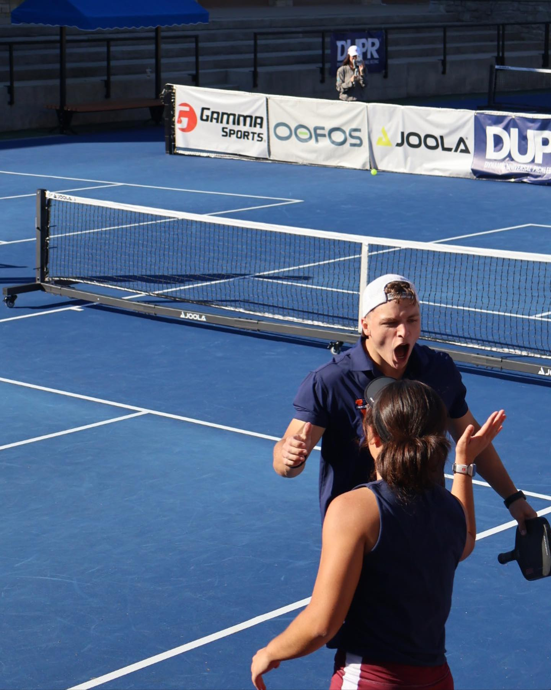
  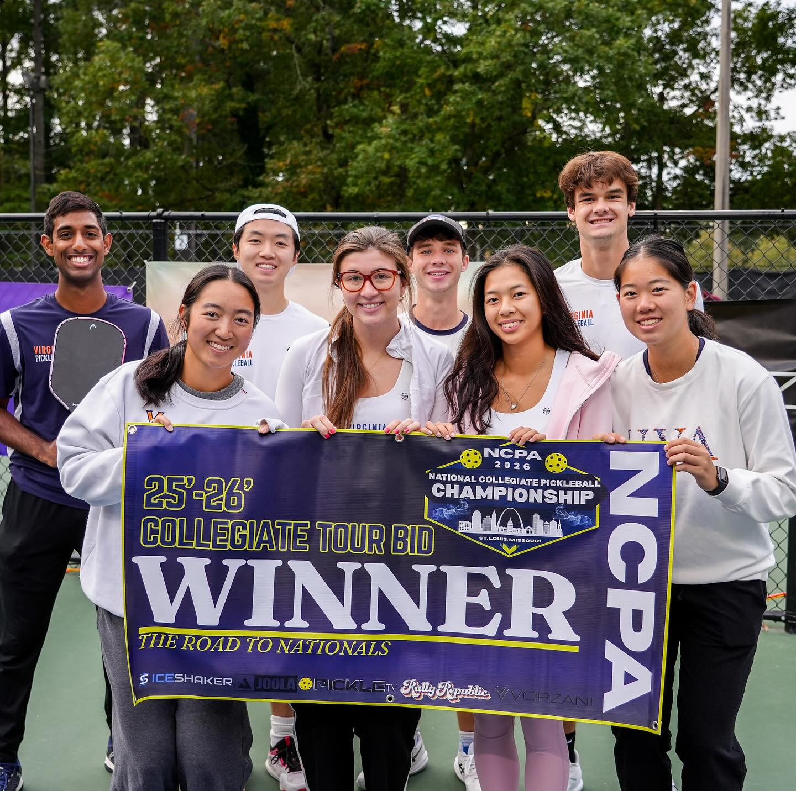
  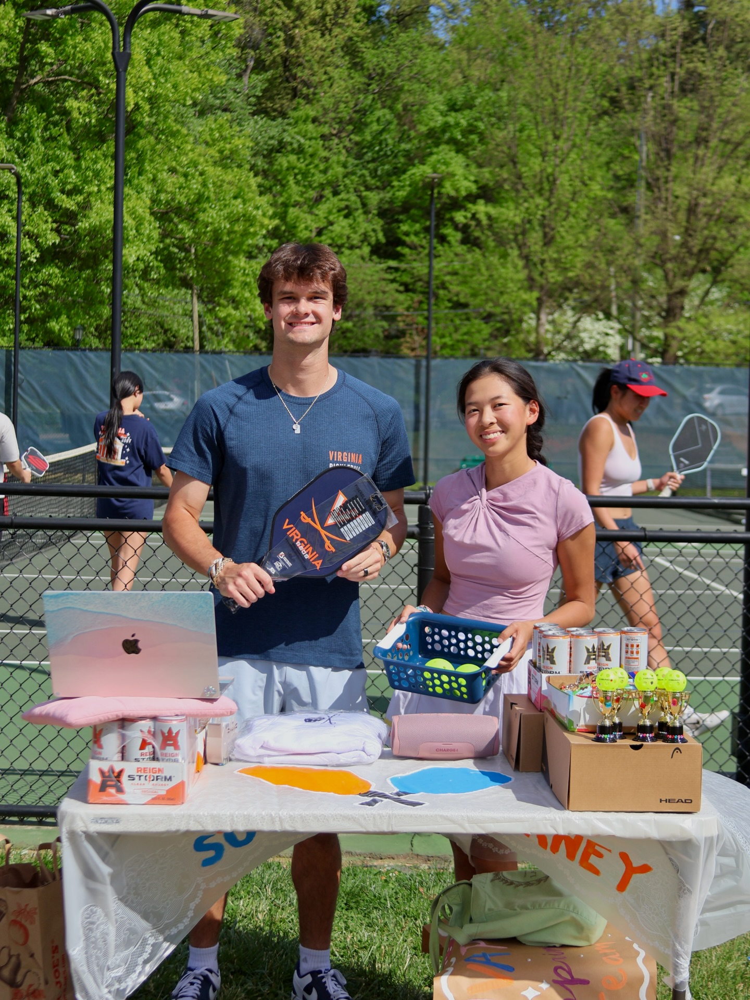
</p>

<p align="center">
  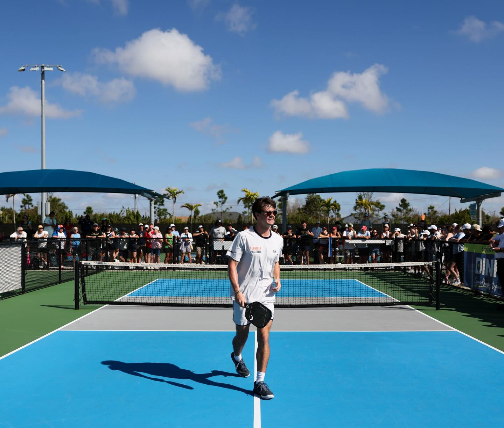
  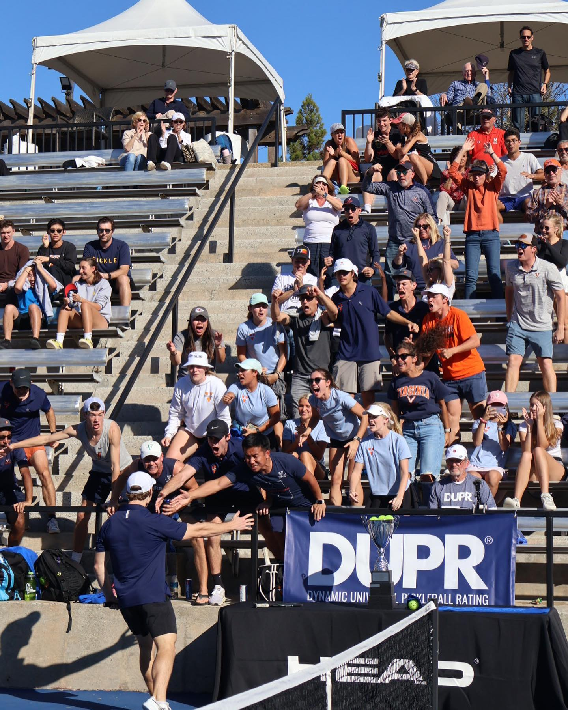
  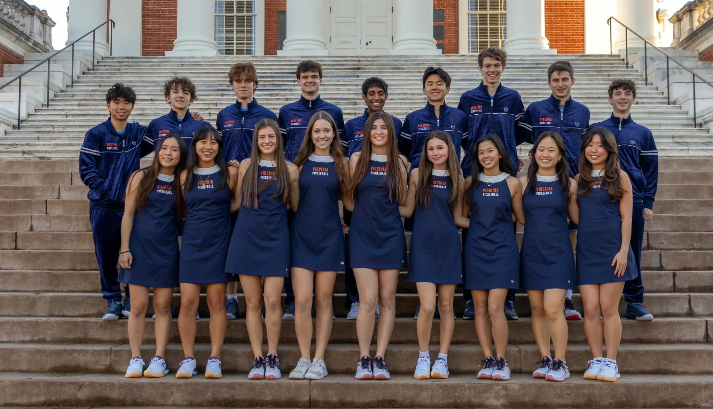
</p>

---

## Getting Started

### Prerequisites

Make sure you have installed:

* Node.js
* npm
* Git

### Installation

Clone the repository:

```bash
git clone https://github.com/Chrisstruong/UVA-Pickleball.git
```

Navigate into the project:

```bash
cd UVA-Pickleball
```

Install dependencies:

```bash
npm install
```

Start the development server:

```bash
npm run dev
```

Open:

```text
http://localhost:3000
```

in your browser.

---

## Roadmap

* [x] Responsive public club website
* [x] Club information and membership pages
* [x] Event interface
* [x] Weekly schedule
* [x] Tournament team roster
* [x] Announcements
* [x] Merchandise catalog
* [x] Sponsor showcase
* [x] Photo gallery
* [ ] UVA email authentication
* [ ] Member profiles
* [ ] PostgreSQL-backed event management
* [ ] Online event registration
* [ ] Role-based access control
* [ ] Administrative dashboard
* [ ] Payment integration
* [ ] Amazon S3 media upload workflow
* [ ] Registration and membership analytics

---

## Why I Built This

This project started as an effort to improve how the UVA Pickleball Club presents information and coordinates its activities online.

As the club grows, managing events, practices, tryouts, registrations, merchandise, and communication through disconnected tools creates unnecessary administrative work.

I am developing the platform as a real-world full-stack software engineering project: identifying operational problems, designing the user experience, building reusable application components, and gradually introducing authentication, databases, cloud infrastructure, and automation.

The goal is not simply to build a website, but to create software that can support the club's day-to-day operations.

---

## Author

**Minh Triet Truong**
Computer Science — University of Virginia

Built as an ongoing full-stack software engineering project for the UVA Pickleball Club.

---

## Disclaimer

This project is developed for the UVA Pickleball Club. University names, trademarks, logos, and third-party brand assets belong to their respective owners.
